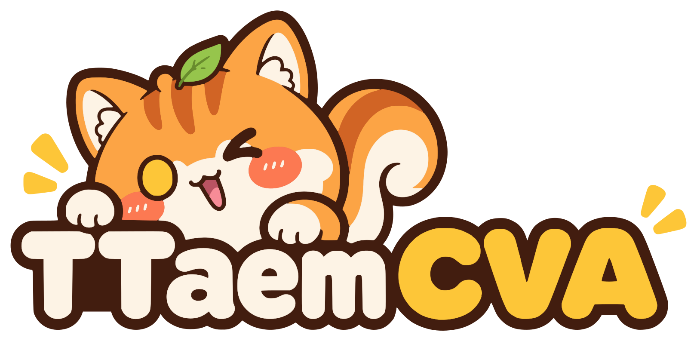
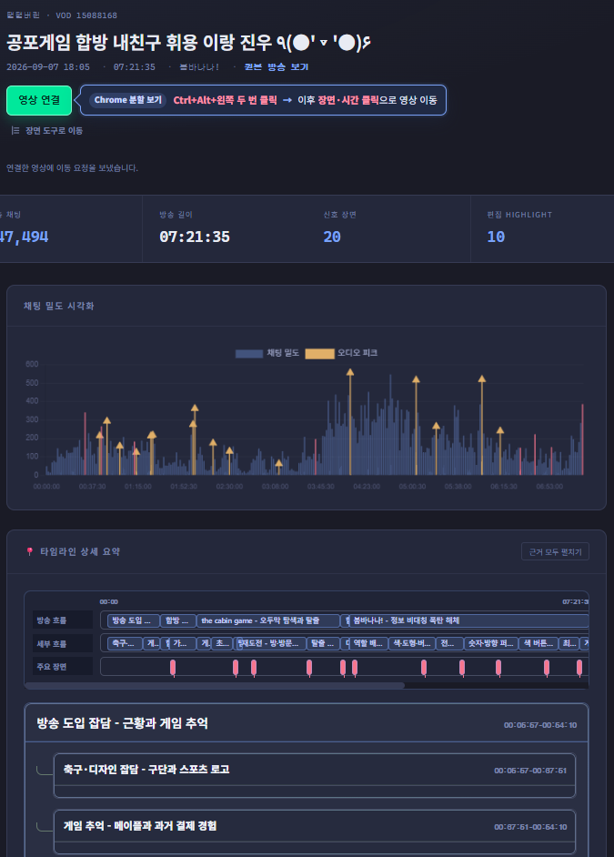
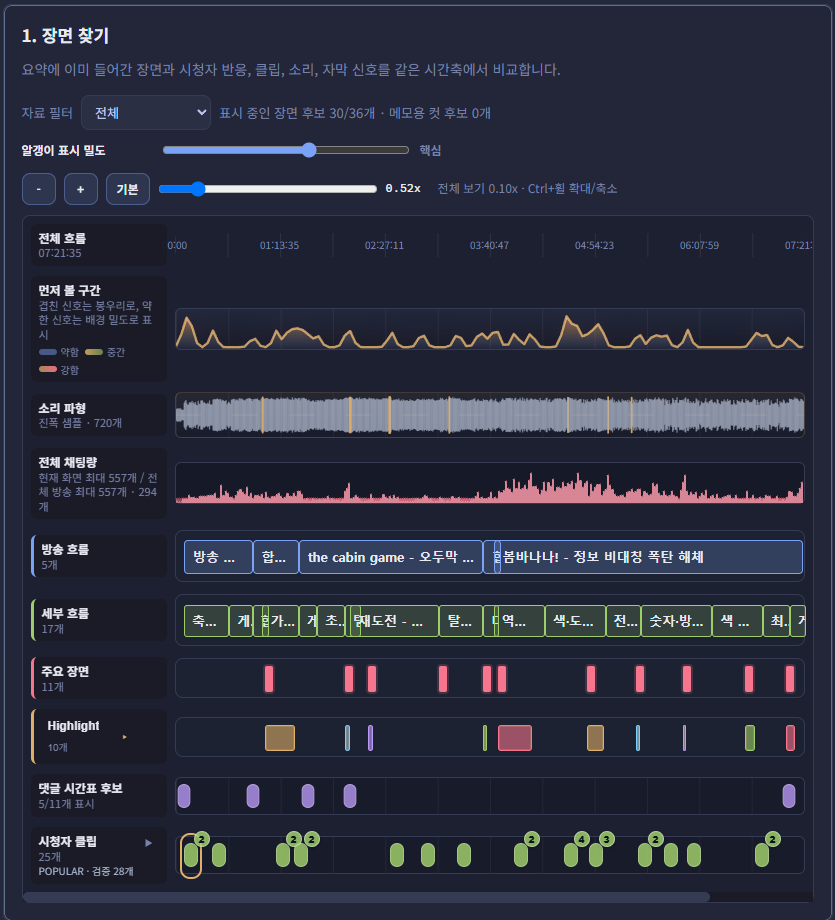

  

<h1 align="center">TTaem CVA</h1>

치지직 다시보기 링크로 만드는 방송 요약 페이지

  <a href="#예시">예시</a> ·
  <a href="#사용법">사용법</a> ·
  <a href="#용어">용어</a> ·
  <a href="CONTRIBUTING.md">기여</a> ·
  <a href="docs/POLICY.md">이용 정책</a>

## 예시

[실제 요약 페이지 보기 →](https://ttaem.com/vods/15088168/report)

### 완성된 요약 페이지

결과물 상단에는 `요약 방식: Loki 2.9.4`가 표시됩니다. **영상 연결**을 `Ctrl+Alt+왼쪽 두 번 클릭`해 Chrome 분할 보기에 연결하면, 이후 타임라인·주요 장면·편집자 워크스페이스의 시간을 클릭할 때 같은 영상 창이 해당 시점으로 이동합니다. Chrome 외 브라우저에서는 화면의 연결 도움말을 따릅니다.

### 장면 찾기

## 사용법

### 1. 처음 준비하기

이 저장소의 **Code → Download ZIP**으로 내려받아 압축을 풀고, 해당 폴더를 Codex에서 엽니다. 이용 가능한 Codex 계정과 인터넷 연결이 필요합니다. 현재 사용 안내는 Windows 기준입니다.

Codex에 다음과 같이 요청하세요.

> 프로젝트의 이용 정책을 읽고, 이 컴퓨터에 맞게 사용할 수 있도록 세팅해줘.

### 2. 요약 페이지 만들기

준비가 끝나면 같은 폴더에서 치지직 다시보기 링크 하나를 전달하세요.

> 이 VOD의 요약 페이지를 만들고 브라우저에서 보여줘: [다시보기 링크]

처음에는 필요한 자료를 내려받아 시간이 걸릴 수 있습니다. 완료되면 방송 요약, 타임라인, 주요 장면과 시청자 클립을 확인할 수 있습니다. 자료가 없거나 선별된 장면이 없으면 해당 항목은 비어 있을 수 있습니다.

### 3. 확인하고 수정하기

**리포트 목록 → 검토할 방송 → 작업공간**으로 이동합니다.

- 제목·요약·시간을 확인하고 수정한 뒤 **수정본 저장**을 누릅니다.
- **미리보기**로 독자에게 보일 페이지를 확인합니다.
- 이전 내용으로 돌아가려면 저장 이력에서 복원합니다.

다시 접속할 때는 Codex에 이렇게 요청하면 됩니다.

> 이 프로젝트의 관리자 화면을 열어줘.

### 4. 게시하기

리포트 목록의 **게시 준비**에서 목적지를 선택합니다. 저장하거나 파일을 준비하는 것만으로 인터넷에 게시되지는 않습니다.

| 목적지 | 사용 방법 |
|---|---|
| 내 사이트 | 게시용 파일을 준비한 뒤, Codex에 올릴 사이트를 알려주고 게시를 요청합니다. |
| ttaem.com | [공식 게시 요청 페이지](https://ttaem.com/community/)가 운영 중입니다. 관리자 화면에서 검토한 `report.json`을 준비한 뒤 공식 양식에 첨부합니다. |

ttaem.com 게시 요청은 다음 순서로 진행합니다.

1. 관리자 화면에서 저장본을 확인하고 목적지로 **ttaem.com 게시 요청용 report.json**을 선택합니다.
2. **이 저장본으로 파일 준비**를 누른 뒤 **ttaem.com 게시 요청 양식 열기**로 공식 접수 페이지를 엽니다.
3. 생성된 `report.json`과 만든 사람 정보를 제출합니다. 형식·보안 검사와 관리자 내용 검토를 통과한 결과만 게시됩니다.

파일 준비만으로 자동 제출되거나 게시되지는 않습니다. 접수 상태 확인과 게시 승인은 공식 접수 페이지의 안내를 따릅니다.

상업 이용·변형판 배포와 정책 문의는 [ttaem00@naver.com](mailto:ttaem00@naver.com)으로 보내주세요. 이 이메일은 `ttaem.com` 결과물 접수 양식을 대신하지 않습니다.

상업 이용과 별도 변형판 배포에는 **TTaem의 사전 서면 허가**가 필요합니다. 생성 페이지 하단의 로고와 `ttaem.com` 표시는 유지해야 합니다. [이용 정책](docs/POLICY.md) · [게시 안내](docs/PUBLISHING.md)

## 용어

| 용어 | 뜻 |
|---|---|
| TTaem CVA | 치지직 VOD를 분석해 요약 페이지를 만들고 검토하는 이 프로젝트입니다. |
| Loki | 관리자 검토를 거쳐 제품에 채택된 방송 요약 방식의 이름입니다. 결과 페이지에는 공개 표기인 `Loki 2.9.4`가 보이고, `2.9.4.2`는 이 저장소의 수정 버전입니다. |
| 영상 연결 | 요약과 CHZZK 영상을 나란히 두고, 요약의 장면·시간 클릭으로 같은 영상 창을 해당 시점으로 이동하는 기능입니다. |
| VOD | 방송이 끝난 뒤 볼 수 있는 다시보기 영상입니다. |
| Codex | 이 프로젝트를 설정하고 VOD 자료를 분석해 요약 페이지를 만드는 작업 도구입니다. 별도 요약 API 대신 현재 프로젝트를 연 Codex를 사용합니다. |
| Whisper | VOD의 음성을 글과 시간 정보로 바꾸는 로컬 음성 인식 모델입니다. |
| 전처리 | 음성 인식 결과의 시간과 짧은 발화 표시를 요약 전에 다듬는 단계입니다. 원본 방송의 의미를 새로 만드는 단계는 아닙니다. |
| 타임라인 | 방송 내용을 시간 순서대로 정리한 목차입니다. |
| D1 · D2 | D1은 큰 주제, D2는 그 안의 세부 주제입니다. |
| Point · 주요 장면 | 주목할 만한 순간과 그 시각입니다. |
| Story | 주요 장면이 어떤 맥락에서 나왔고 왜 눈여겨볼 만한지 설명한 내용입니다. |
| Highlight · 하이라이트 | 볼 만한 흐름을 갖춘 장면의 시작과 끝 구간입니다. 별도의 영상 파일을 만드는 기능은 아닙니다. |
| 피크 | 채팅 반응이나 소리의 변화가 두드러진 시점입니다. 주요 장면을 찾는 참고 자료로 사용합니다. |
| 시청자 클립 | 시청자가 치지직에 만든 클립 중 해당 방송과 시점이 확인된 항목입니다. |
| 작업공간 | 생성된 요약을 검토하고 수정·저장하는 관리자 화면입니다. |
| 로컬 초안 | 아직 인터넷에 게시하지 않고 현재 컴퓨터에만 저장된 결과입니다. |
| 미리보기 · 게시 | 미리보기는 내 컴퓨터에서 확인하는 것이고, 게시는 선택한 사이트에 올리는 것입니다. |

코드 기여 과정에서 쓰는 Aemeth·Stelle·StarrailTopology 등의 뜻은 [기여 안내](CONTRIBUTING.md#기여-작업-용어)에 정리되어 있습니다.
